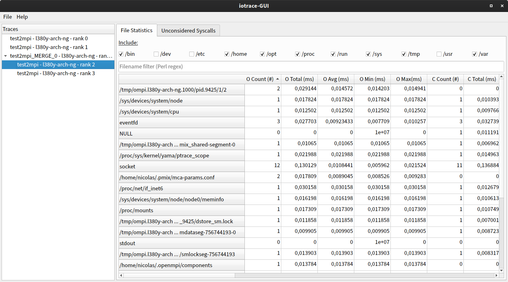

# iotrace-GUI

iotrace-GUI is a tool for displaying the traces generated by
[iotrace](https://github.com/nicolasgross/iotrace). These traces contain
information about the I/O behavior of the traced program. Besides displaying
the traces, the tool is also able to merge traces. For further information
about the content of the traces, please have a look at
[iotrace](https://github.com/nicolasgross/iotrace).

iotrace-GUI was developed by [Nicolas Gross](https://github.com/nicolasgross)
in the course of a student assistant job at the [HLRS](https://www.hlrs.de)
under [Christoph Niethammer](https://github.com/cniethammer).

## Dependencies
- Python 3
- PySide2

## Build
Just clone the repository: `git clone
https://github.com/nicolasgross/iotrace-gui`

## Usage
1. Change directory to the cloned repository: `cd PATH_TO_CLONED_REPOSITORY`
2. Run iotrace-GUI: `python -m iotracegui`

In the columns of the file statistics tab, *O* stands for *Open*, *C* for
*Close*, *R* for *Read* and *W* for *Write*.

#### Load trace files
Trace files can be loaded via the menu bar under *File → Open*.

#### Merge/remove traces
Select traces in the list on the left, merge/remove are available in the
context menu via right-click.

A trace cannot be removed if it is part of a merged trace, the merged
trace must be removed first.

A set of traces cannot be merged if one of them is already a merged trace
or part of a merged trace.

## License
Copyright © 2019 HLRS, University of Stuttgart. iotrace-GUI is published under
the terms of GPL3.

